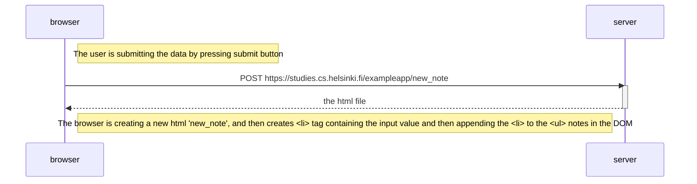
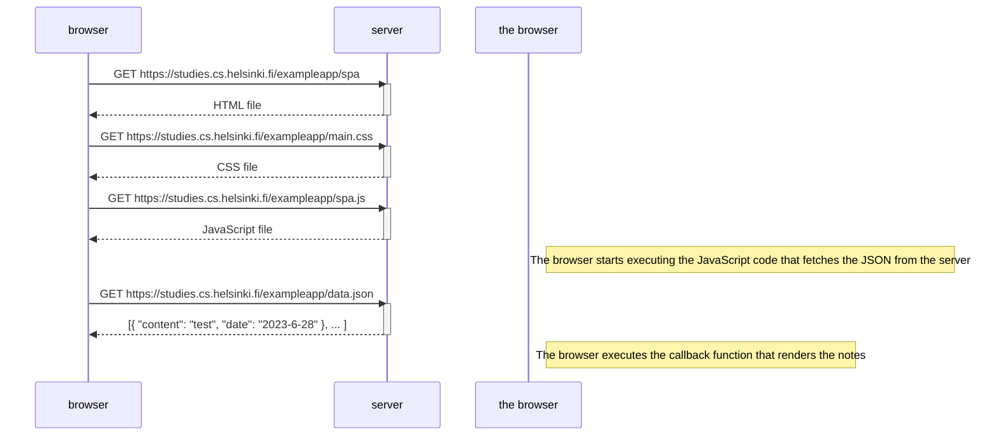
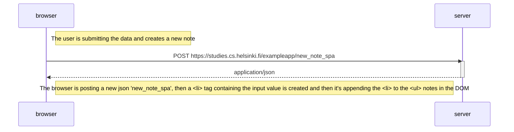

Exercuse 0.4

```mermaid
sequenceDiagram
    participant browser
    participant server

    Note right of browser: The user is submitting the data by pressing submit button

    browser->>server: POST https://studies.cs.helsinki.fi/exampleapp/new_note
    activate server
    server-->>browser: the html file
    deactivate server

    Note right of browser: The browser is creating a new html 'new_note', and then creates <li> tag containing the input value and then appending the <li> to the <ul> notes in the DOM
```

Exercise 0.5

```mermaid
sequenceDiagram
    participant browser
    participant server

    browser->>server: GET https://studies.cs.helsinki.fi/exampleapp/spa
    activate server
    server-->>browser: HTML file
    deactivate server

    browser->>server: GET https://studies.cs.helsinki.fi/exampleapp/main.css
    activate server
    server-->>browser: CSS file
    deactivate server

    browser->>server: GET https://studies.cs.helsinki.fi/exampleapp/spa.js
    activate server
    server-->>browser: JavaScript file
    deactivate server

    Note right of the browser: The browser starts executing the JavaScript code that fetches the JSON from the server

    browser->>server: GET https://studies.cs.helsinki.fi/exampleapp/data.json
    activate server
    server-->>browser: [{ "content": "test", "date": "2023-6-28" }, ... ]
    deactivate server

    Note right of the browser: The browser executes the callback function that renders the notes
```

Exercise 0.6

```mermaid
sequenceDiagram
    participant browser
    participant server

    Note right of browser: The user is submitting the data and creates a new note

    browser->>server: POST https://studies.cs.helsinki.fi/exampleapp/new_note_spa
    activate server
    server-->>browser: application/json
    deactivate server

    Note right of browser: The browser is posting a new json 'new_note_spa', then a <li> tag containing the input value is created and then it's appending the <li> to the <ul> notes in the DOM
```
